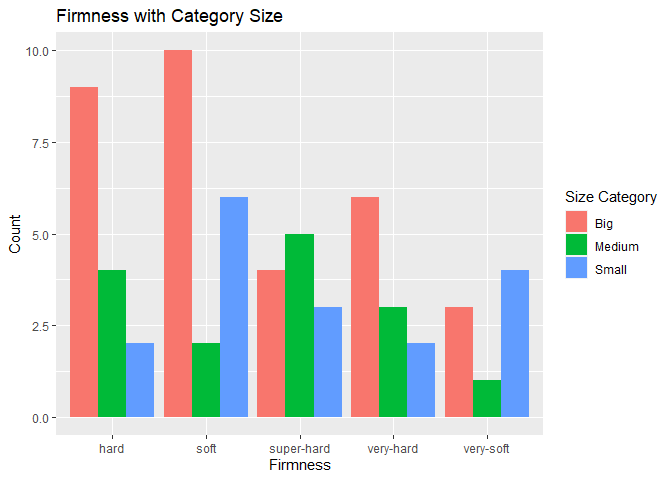
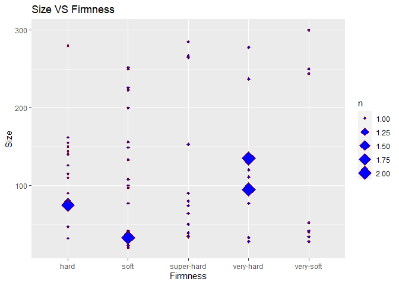
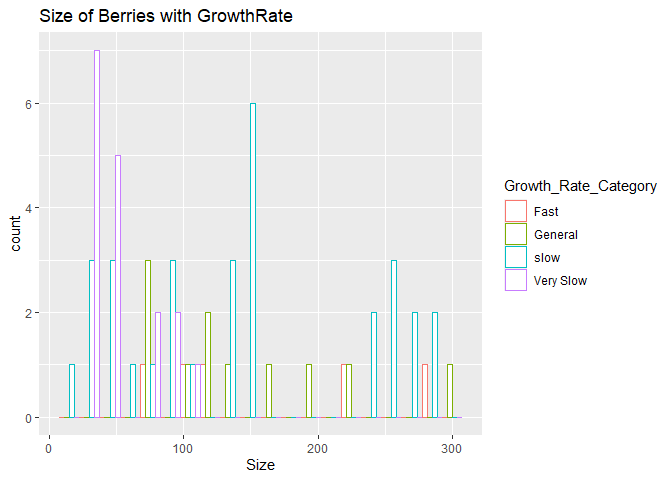
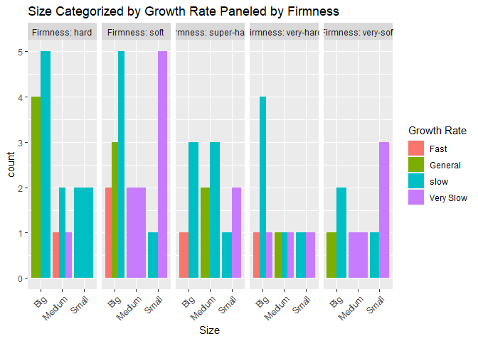
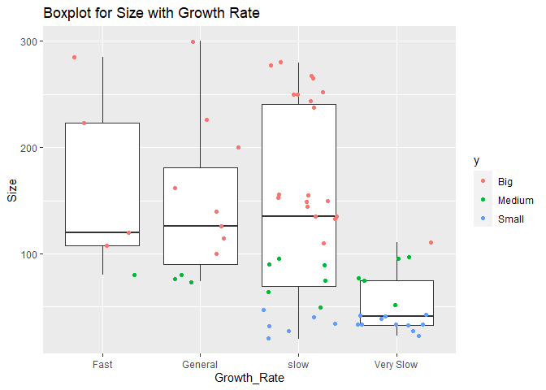
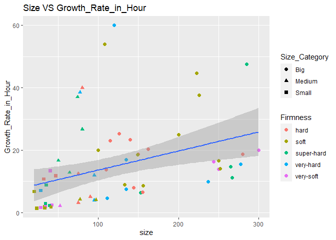
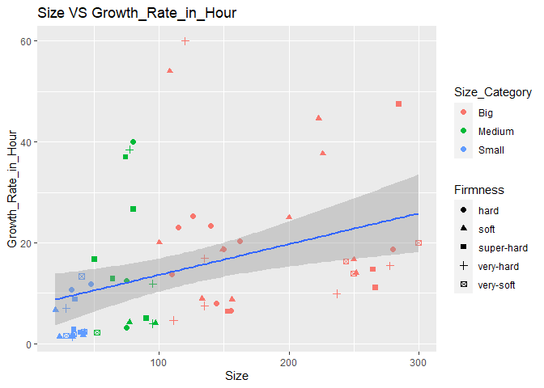

ST558 Project 1
================
Jiatao Wang
9/18/2021

# Goal

**This Project aims to accessing data from API, and make some
Exploratory Data Analysis.**

API that is using in this project can be access
[here](https://pokeapi.co/)  
Pokémon is childhood memory for lots of people.

I used to play Pokémon on Game Boy Advance SP

<!-- -->
<!-- -->

# The packages in R that are needed in this project

[**knitr**](https://www.rdocumentation.org/packages/knitr/versions/1.30)
[**httr**](https://httr.r-lib.org/)
[**jsonlite**](https://cran.r-project.org/web/packages/jsonlite/vignettes/json-aaquickstart.html)
[**tidyverse**](https://www.tidyverse.org/)
[**rmarkdown**](https://www.rdocumentation.org/packages/rmarkdown/versions/1.7)
[**imager**](https://www.rdocumentation.org/packages/imager/versions/0.41.2)

# Here is the code I need to contact API and extract some data from the pokeapi

## Universal Function

**This is the function that inputs the endpoints, as well as the choices
you can specify with those endpoints**  
*note:please read in all other functions listed in the **functions**
section before using this universal function* *note:all choices you can
look up generated from output **tt** under sections which is specified
and described in each function*

Input endpoint includes:

*berry  
*growth-rate  
*berry-flavor  
*item  
\*move

Choices can be 0 or other numeric values.

**How to use this universal function:**

**1.For example, the endpoint berry contains 64 choices, that is, 64
types of berry.**  
**2.For the berry data, if the choice is 0, it returns all the berries
and their attributes.**  
**3.For the growth-rate data, if the choice is 0, it will returns the
growth rate, corresponding formula as well as the levels with
corresponding experience needed. In this case, all pokemon species share
same experience points needed to have each level up.**  
**4.If the choice is not 0 for the growth-rate endpoint, it will return
the pokemon species which are under the category of growth-rate, for
example, if we input choice = 1, it will return the all the pokemon
species that are categorized as slow growth-rate. etc….**  
**5.The total number of categories for the berry flavor is 5.**  
**6.The total number of categories for the growth rate is 6. if you
enter the number of choice greater than 6, it will return error, same
rule applies to the other endpoint**  
**7.For the endpoint item/move, if the choice is 0, it will return all
the items/moves and its attribute, if the choice is not zero, it will
return up to numbers of item/move you want to get up to your choice.**  
**8.Recommendation: for the item and move endpoint, the time to get all
the moves or items may take longer time. You can specify the choice to
be **100** or **200****

``` r
get_endpoints <- function(endpoint,choice){
  limit <- paste0(endpoint,"/?limit=1000")
  overall <- GET(paste0("https://pokeapi.co/api/v2/",limit))
  getdata_text_all <- content(overall,"text")
  getdata_json_all<- fromJSON(getdata_text_all, flatten = TRUE)
  tt <- as_tibble(getdata_json_all$results)
  
  
             if(endpoint == "berry"){
               if(choice == 0){
                    C <- lapply(tt$name,get_Berry,tt)
                       D<-do.call(rbind,C)
                       return(D)
                        }
               if(choice != 0){
                    C <- lapply(tt$name[choice],get_Berry,tt)
                       D<-do.call(rbind,C)
                       return(D)
               }
             }  

             if(endpoint == "growth-rate"){
               if(choice == 0){
                 C <- lapply(tt$name,get_growth_rate,tt)
                 D<- do.call(rbind,C) 
                 return(D)
                 } 
               if(choice != 0){
                   PokeMon1 <- get_growth_species(tt$name[choice],1,tt)
                #for (i in 1:length(look_all$name)){
                    c = length(fromJSON(content(GET(tt$url[choice]),"text"),flatten = TRUE)$pokemon_species$name)
                      for (j in 2:c){
                        PokeMon1 <- bind_rows(PokeMon1, get_growth_species(tt$name[choice],j,tt))
                          if (length(PokeMon1$species.name)==c){
                            return(PokeMon1) 
                        }
                      }
                    }
              }         
                  
             if(endpoint == "berry-flavor"){
                if(choice == 0){
                    C <- lapply(tt$name,get_Berry_Flavors,tt)
                    D<-do.call(rbind,C) 
                    return(D) 
                          }
                if(choice != 0){
                    C <- lapply(tt$name[choice],get_Berry_Flavors,tt)
                    D<-do.call(rbind,C) 
                    return(D)
               }
             }
  
             if(endpoint == "item"){
               if(choice == 0){
                 C <- lapply(tt$name,get_item,tt)
                 D<-do.call(rbind,C)
                 return(D)
               }
               if(choice != 0){
                 C <- lapply(tt$name[1:choice],get_item,tt)
                 D<-do.call(rbind,C)
                 return(D)
               }
             }
  
            if(endpoint == "move"){
              if(choice == 0){
                C <- lapply(tt$name,get_moves,tt)
                D<-do.call(rbind,C)
                return(D)
              }
              if(choice !=0){
                C <- lapply(tt$name[1:choice],get_moves,tt)
                D<-do.call(rbind,C)
                return(D)
              }
            }
}
```

## Functions

pokeapi is kind of tricky restAPI. one endpoint may contains several
other endpoints.  
Thoughts were wandering around my minds.

***These are individual functions that I am using in the universal
function above.We could use those functions to return the data, but we
need to set up some pre-data to access those functions. For example, we
need to get berry names and its urls before we can use its function
written by me. Codes are provided below.***

Functions are:  
1.`get_moves`  
2.`get_growth_species`  
3.`get_growth_rate`  
4.`get_item`  
5.`get_Berry_Flavors`  
6.`get_Berry`

### 1 `get_moves`

**This Function get the moves, which are the skills of Pokémon in
battle. In battle, a Pokémon uses one move each turn. Some moves
(including those learned by Hidden Machine) can be used outside of
battle as well, usually for the purpose of removing obstacles or
exploring new areas.**

tt is the data frame containing all the names of moves and urls  
get\_moves access each move by specifying its name and input tt.  
s = name of the move (can see it in tt) (quote s for the input)  
tt = dataset obtained in the code above the this function.

``` r
#Rate <- GET("https://pokeapi.co/api/v2/move/?limit=1000")
#getdata_textRate <- content(Rate,"text")
#getdata_json_Rate<- fromJSON(getdata_textRate, flatten = TRUE)
#tt <- as_tibble(getdata_json_Rate$results)  

get_moves <- function(s,tt) {

    url <- tt$url[which(tt$name==s)]
    r <- GET(url=url)
    x <- content(r, 'text')
    Json_x<- fromJSON(x, flatten = TRUE)
    # pull data from several end points(which are all attributes associate with growth_rate)
    Name <- Json_x$name
    Power <- ifelse(!is.null(Json_x$power),Json_x$power,NA)
    power_point <- Json_x$pp
    Priority <-Json_x$priority
    target <- Json_x$target$name
    type <- Json_x$type$name
    damage_class <- Json_x$damage_class$name
    effect <- Json_x$effect_entries$effect
    short_effect <- Json_x$effect_entries$short_effect
    generation <- Json_x$generation$name
    
    moves <- tibble(
    name = Name,
    power = Power ,
    Power.Point = power_point,
    priority =Priority,
    target_name = target ,
    Type = type,
    Damage_class = damage_class,
    effects = effect,
    short_effects = short_effect,
    Generation = generation
  )
   return(moves)
}    

#C <- lapply(tt$name[1:50],get_moves,tt)
#D<- do.call(rbind,C)
```

### 2.`get_growth_species`

**This function get species, while access the several endpoints, the
pokeapi is built with endpoints with endpoints, that is, growth-rate is
one endpoints but some of the returned variables we can get are also
endpoints. We access the pokemon-species(endpoint) inside the growth
rate endpoint.**

tt is the data frame containing all the names of growth-rate and urls  
this function take input  
s = one of the growth rate category (can see it in tt) (quote s for the
input)  
i = the target species within the growth rate.  
tt= the dataset obtained in the code above the function

``` r
#functions are slowed by the ifelse statement..........                               
 
#Rate <- GET("https://pokeapi.co/api/v2/growth-rate/")
#getdata_textRate <- content(Rate,"text")
#getdata_json_Rate<- fromJSON(getdata_textRate, flatten = TRUE)
#tt <- as_tibble(getdata_json_Rate$results)  

get_growth_species <- function(s,i,tt) {

    url <- tt$url[which(tt$name==s)]
    r <- GET(url=url)
    x <- content(r, 'text')
    Json_x<- fromJSON(x, flatten = TRUE)
    # pull data from several end points(which are all attributes associate with growth_rate)
    Growth_Category <- s
    Growth_Formula <- Json_x$formula
    Growth_levels <- matrix(unlist(Json_x$levels$level),,1)
    Growth_experience <-matrix(unlist(Json_x$levels$experience),,1)
    species_name <- matrix(unlist(Json_x$pokemon_species$name),,1)
#for (i in 1:length(Json_x$pokemon_species$url)){
    url2<-Json_x$pokemon_species$url[i]
    r2 <-GET(url=url2)
    x2 <-content(r2, 'text')
    Json_x2<- fromJSON(x2, flatten = TRUE)
    
    pokeName <-Json_x2$name
    Base_Happiness <- Json_x2$base_happiness
    Capture_Rate <- Json_x2$capture_rate
    Color <- Json_x2$color$name
    Evolves <- ifelse(!is.null(Json_x2$evolves_from_species$name),Json_x2$evolves_from_species$name,NA)
    Generation <- Json_x2$generation$name
    Form_Switchable <- Json_x2$forms_switchable
    Habit <- ifelse(!is.null(Json_x2$habitat$name),Json_x2$habitat$name,NA)
    Hatch_COunter <- Json_x2$hatch_counter
    Shape <- Json_x2$shape$name

    
    pokemon_species <- tibble(
    species.name = pokeName,
    Growth_Category = s,
    Growth.Formula = Growth_Formula,
    BaseHappiness = Base_Happiness,
    Capture.Rate = Capture_Rate,
    Color.poke = Color,
    Evolves.poke = Evolves,
    Generation.poke = Generation,
    Form_Switchable.poke = Form_Switchable,
    Habit.poke = Habit,
    Hatch_COunter.poke =Hatch_COunter,
    Shape.poke = Shape
  )
    for (i in length(pokemon_species)){
      ifelse(!is.null(pokemon_species[i]),pokemon_species[i],NA)
    }
    
   return(pokemon_species)

    
}    

    
#create the tibble that containing the names of the all species as well cols of their attributes. 
# this works but is a little bit slow using what I wrote. 
#PokeMon <- get_growth_species(tt$name[1],1,tt)
#for (i in 1:length(tt$name)){
#  for (j in 2:length(fromJSON(content(GET(tt$url[i]),"text"),flatten = TRUE)$pokemon_species$name)){
#     PokeMon <- bind_rows(PokeMon,get_growth_species(tt$name[i],j,tt)) 
#  }
   
#}
```

### 3.`get_growth_rate`

**This is the function written to get level and experience as well as
growth-rate/growth-formula**  
tt is the data frame containing all the names of growth-rate and urls  
This function takes input:  
s = the growth rate category (can see it in tt) (quote s for the
input)  
tt= the data set obtained in the code above the function

``` r
get_growth_rate <- function(s,tt) {

    url <- tt$url[which(tt$name==s)]
    r <- GET(url=url)
    x <- content(r, 'text')
    Json_x<- fromJSON(x, flatten = TRUE)
    # pull data from several end points(which are all attributes associate with growth_rate)
    Growth_Category <- s
    Growth_Formula <- Json_x$formula
    Growth_levels <- matrix(unlist(Json_x$levels$level),,1)
    Growth_experience <-matrix(unlist(Json_x$levels$experience),,1)
#    species_name <- matrix(unlist(Json_x$pokemon_species$name),,1)

    
    #create the tibble that containing the categories of growth-rate as well cols of their attributes. 
  df <- tibble(
     Category_s_ = Growth_Category,
     Formula_s_ = Growth_Formula,
     level = Growth_levels,
     experience = Growth_experience
     
  )
   return(df)
}
#fast way to get full dataset 
#C <- lapply(tt$name,get_growth_rate,tt)
#D<- do.call(rbind,C) 


#this is another way to get all full data set from 
#df2 <- get_growth_rate(Growth_Rate_look$name[1])
#for (i in 2:length(Growth_Rate_look$name)){
#    df2 <- cbind(df2, get_growth_rate(Growth_Rate_look$name[i])[,1:2])
#}
```

### 4.`get_item`

**This is the function written to get item we can get from pokemon as
well as attributes of items**  
tt is the data frame containing all the names of items and urls  
This function takes input:  
s = each item name (can see it in tt) (quote s for the input)  
tt= the data set obtained in the code above the function

``` r
#Rate <- GET("https://pokeapi.co/api/v2/item/?limit=1000")
#getdata_textRate <- content(Rate,"text")
#getdata_json_Rate<- fromJSON(getdata_textRate, flatten = TRUE)
#tt <- as_tibble(getdata_json_Rate$results)    


get_item <- function(s,tt) {

    url <- tt$url[which(tt$name==s)]
    r <- GET(url=url)
    x <- content(r, 'text')
    Json_x<- fromJSON(x, flatten = TRUE)
    # pull data from several end points(which are all attributes associate with items)
    Name <- Json_x$name
    Attributes <- paste(Json_x$attributes$name,collapse=";")
    Category <- Json_x$category$name
    Cost <- Json_x$cost
    Effect <- Json_x$effect_entries$effect
    Short_effect <- Json_x$effect_entries$short_effect
    #baby_trigger_for <- ifelse(!is.null(Json_x$baby_trigger_for),Json_x$baby_trigger_for, NA)
    #fling_effect <-ifelse(!is.null(Json_x$fling_effect),Json_x$fling_effect,NA)

    #fling_power <- ifelse(!is.null(Json_x$fling_effect),Json_x$fling_effect,NA)

    
    #create the tibble that containing the names of the items as well cols of their attributes. 
  df <- tibble(
     name = Name,
     attributes = Attributes,
     category = Category,
     cost  = Cost,
     effect = Effect ,
     short_effect = Short_effect
     #Baby_trigger_for = baby_trigger_for,
     #Fling_power = fling_power
     
  )
   return(df)
}


#this is another way to get full dataset. 
#df2 <- get_item(tt$name[1],tt)
#for (i in 2:length(tt$name)){
#    df2 <- bind_rows(df2, get_item(tt$name[i],tt))

#} 


#This is a quicker way..... much quicker 
#C <- lapply(tt$name[1:150],get_item,tt)
#D<-do.call(rbind,C)
```

### 5.`get_Berry_Flavors`

**This function return the berries names that share same type of flavor,
as well as some attributes of flavors.**  
tt is the dataframe containing all the names of berry-flavor and urls  
This function takes input:  
s = each type of flavor (can see it in tt) (quote s for the input)  
tt = the data set obtained in the code above the function

``` r
# after getting the data set of berry containing the name and its url links, writing the function that call the attributes of each type of berry
  # caution: this function only return the single berry that you are interested. 
  
# this function return the  berries names that share same type of flavor, as well as some attributes of flavors.   
# E <- GET("https://pokeapi.co/api/v2/berry-flavor/")
#  getdata_text <- content(E,"text")
# getdata_json<- fromJSON(getdata_text, flatten = TRUE)
# tt <- as_tibble(getdata_json$results)
   
  get_Berry_Flavors <- function(s,tt){
   url <- tt$url[which(tt$name==s)]
    r <- GET(url=url)
    c <- content(r, 'text')
    x <- fromJSON(c, flatten = TRUE)
    # pull data from several end points(which are all attributes associate with berries)
    flavor_name <- x$name
    flavor_contest_type <- matrix(x$contest_type$name,,1)
    flavor_type_berries <- matrix(x$berries$berry.name,,1)
    flavor_potency <- x$berries$potency
    
   berry_flavor <- tibble(
     Flavor_Name = flavor_name,
     contest_type = flavor_contest_type,
     berries_name = flavor_type_berries,
     Flavor_potency = flavor_potency,
  )
   return(berry_flavor)
 }
#df <- getBerry_Flavors(tt$name[1],tt)
#for (i in 2:length(tt$name)){
#    df <- rbind(df, getBerry_Flavors(tt$name[i],tt))
#}
  
# C <- lapply(tt$name[1],getBerry_Flavors,tt)
#D<-do.call(rbind,C) 
```

### 6.`get_Berry`

**This is the function written to get berry and its attributes.**  
tt is the data frame containing all the names of berry and urls  
This function takes input:  
s =name of the berry (can see it in tt) (quote s for the input)  
tt= the data set obtained in the code above the function

``` r
#  E <- GET("https://pokeapi.co/api/v2/berry/?limit=1000")
#  getdata_text <- content(E,"text")
#  getdata_json<- fromJSON(getdata_text, flatten = TRUE)
#  tt <- as_tibble(getdata_json$results) 
  
  get_Berry <- function(s,tt){
    url <- tt$url[which(tt$name==s)]
    r <- GET(url=url)
    x <- content(r, 'parsed')
    # pull data from several end points(which are all attributes associate with berries)
    berry_name <- x$name
    berry_growth_time <- x$growth_time
    berry_size <- x$size
    berry_firmness <- x$firmness$name
    berry_max_harvest <-x$max_harvest
    berry_natural_gift_power <- x$natural_gift_power
    berry_natural_gift_type <- x$natural_gift_type$name
#    berry_flavor <- x$flavors$flavor.name
#    berry_flavor_potency <- x$flavors$potency
    berry_soil_dryness <- x$soil_dryness
    berry_smoothness <- x$smoothness
    #create the tibble that containing the names of the berries as well cols of their attributes. 
    berry <- tibble(
     Name = berry_name,
     Growth_Time = berry_growth_time,
     Size = berry_size,
     Firmness = berry_firmness,
     Max_Harvest = berry_max_harvest,
     Natural_Gift_Power = berry_natural_gift_power,
     Natrual_Gift_Type = berry_natural_gift_type,
 #    Flavor = berry_flavor,
 #    Flavor_Potency = berry_flavor_potency,
     Soil_Dryness = berry_soil_dryness,
     Smoothness =  berry_smoothness
  )
  return(berry)
}


# using a loop to get all the berry and its attributes by using the function getB 
# is I use the wrapper function in this part, it will return the list of all rbind datasets 
# from the obs 2 to obs 20 each. so I abandoned using wrapper function, just used a for loop inorder to get the dataframe. 
#df <- getBerry(tt$name[1],tt)
#for (i in 2:length(tt$name)){
#    df <- do.call(rbind, list(getBerry(tt$name[i],tt)))
#}

#this is a faster way
# C <- lapply(tt$name,getBerry,tt)
#do.call(rbind,C) 
```

## Here is some description of varaibles in the data set

They are all attributes of different type of berry in the game Pokemon
**growth\_time** Time it takes the tree to grow one stage, in hours.
Berry trees go through four of these growth stages before they can be
picked.

**max\_harvest** The maximum number of these berries that can grow on
one tree in Generation IV.

**natural\_gift\_power** The power of the move “Natural Gift” when used
with this Berry.

**natural\_gift\_type** The type inherited by “Natural Gift” when used
with this Berry.

**size** The size of this Berry, in millimeters.

**firmness** The firmness of this berry, used in making Pokéblocks or
Poffins.

**smoothness** The smoothness of this Berry, used in making Pokéblocks
or Poffins.

**soil\_dryness** The speed at which this Berry dries out the soil as it
grows. A higher rate means the soil dries more quickly.

Let’s look at this data set first

``` r
get_endpoints("berry",0)
```

    ## # A tibble: 64 x 9
    ##    Name   Growth_Time  Size Firmness   Max_Harvest Natural_Gift_Power Natrual_Gift_Type Soil_Dryness Smoothness
    ##    <chr>        <int> <int> <chr>            <int>              <int> <chr>                    <int>      <int>
    ##  1 cheri            3    20 soft                 5                 60 fire                        15         25
    ##  2 chesto           3    80 super-hard           5                 60 water                       15         25
    ##  3 pecha            3    40 very-soft            5                 60 electric                    15         25
    ##  4 rawst            3    32 hard                 5                 60 grass                       15         25
    ##  5 aspear           3    50 super-hard           5                 60 ice                         15         25
    ##  6 leppa            4    28 very-hard            5                 60 fighting                    15         20
    ##  7 oran             4    35 super-hard           5                 60 poison                      15         20
    ##  8 persim           4    47 hard                 5                 60 ground                      15         20
    ##  9 lum             12    34 super-hard           5                 60 flying                       8         20
    ## 10 sitrus           8    95 very-hard            5                 60 psychic                      7         20
    ## # ... with 54 more rows

``` r
df <- get_endpoints("berry",0)
```

### Then we did some exploratory data analysis on the orignial dataset.

we create two new variables as well as categorizing some potential
predictors  
1.one is **Growth\_Rate\_in\_Hour**,which is the Size divided by growth
time.  
2.another one is **Pokeblocks\_Productivity** which is the smoothness
divided by soil dryness.  
3.categorized Size and Growth\_Rate\_in\_Hour.

``` r
library(tidyverse)
# create two new variables:
NewPoke <- df %>% mutate(Growth_Rate_in_Hour = round(Size/Growth_Time,digits=2), Pokeblocks_Productivity = round(Smoothness/Soil_Dryness,digits =2) )
# create a factor level for the growth_rate first 
v<- ifelse(NewPoke$Growth_Rate_in_Hour >= 40, "Fast",
       ifelse(NewPoke$Growth_Rate_in_Hour >= 20, "General",
              ifelse(NewPoke$Growth_Rate_in_Hour >= 5,"slow","Very Slow"))
       )

m<-ifelse(NewPoke$Size >= 100, "Big",
       ifelse(NewPoke$Size >= 50, "Medium",
              ifelse(NewPoke$Size >= 0,"Small"))
       )

NewPoke$Growth_Rate_Category <- v
NewPoke$Size_Category <- m
```

Now the data set look like this:

``` r
NewPoke
```

    ## # A tibble: 64 x 13
    ##    Name   Growth_Time  Size Firmness   Max_Harvest Natural_Gift_Power Natrual_Gift_Type Soil_Dryness Smoothness Growth_Rate_in_H~
    ##    <chr>        <int> <int> <chr>            <int>              <int> <chr>                    <int>      <int>             <dbl>
    ##  1 cheri            3    20 soft                 5                 60 fire                        15         25              6.67
    ##  2 chesto           3    80 super-hard           5                 60 water                       15         25             26.7 
    ##  3 pecha            3    40 very-soft            5                 60 electric                    15         25             13.3 
    ##  4 rawst            3    32 hard                 5                 60 grass                       15         25             10.7 
    ##  5 aspear           3    50 super-hard           5                 60 ice                         15         25             16.7 
    ##  6 leppa            4    28 very-hard            5                 60 fighting                    15         20              7   
    ##  7 oran             4    35 super-hard           5                 60 poison                      15         20              8.75
    ##  8 persim           4    47 hard                 5                 60 ground                      15         20             11.8 
    ##  9 lum             12    34 super-hard           5                 60 flying                       8         20              2.83
    ## 10 sitrus           8    95 very-hard            5                 60 psychic                      7         20             11.9 
    ## # ... with 54 more rows, and 3 more variables: Pokeblocks_Productivity <dbl>, Growth_Rate_Category <chr>, Size_Category <chr>

Now We create some tables using the new data set. NewPoke!

**table 1**  
Firmness of the berry versus Natural Gift Type

``` r
# contingency table 
table(NewPoke$Firmness, NewPoke$Natrual_Gift_Type)
```

    ##             
    ##              bug dark dragon electric fighting fire flying ghost grass ground ice normal poison psychic rock steel water
    ##   hard         2    0      0        0        1    0      0     2     2      3   0      0      2       0    2     0     1
    ##   soft         1    2      2        0        1    3      2     1     1      1   0      0      0       2    1     0     1
    ##   super-hard   0    1      2        1        0    1      1     1     0      0   1      0      1       1    0     1     1
    ##   very-hard    0    0      0        0        2    0      1     0     1      0   3      0      1       1    0     1     1
    ##   very-soft    1    1      0        3        0    0      0     0     0      0   0      1      0       0    1     1     0

**table 2**  
Firmness versus Growth Rate in Category We can see from this table that
almost half of the berry growth slowly, and in this slow category, the
hard firmness types tak up the most count

``` r
table(NewPoke$Firmness, NewPoke$Growth_Rate_Category)
```

    ##             
    ##              Fast General slow Very Slow
    ##   hard          1       4    9         1
    ##   soft          2       3    6         7
    ##   super-hard    1       2    7         2
    ##   very-hard     1       1    6         3
    ##   very-soft     0       1    3         4

**table 3**  
Size Category versus Firmness of the berry  
There is no distinct linear relationship between size and firmness

``` r
table(NewPoke$Size_Category,NewPoke$Firmness)
```

    ##         
    ##          hard soft super-hard very-hard very-soft
    ##   Big       9   10          4         6         3
    ##   Medium    4    2          5         3         1
    ##   Small     2    6          3         2         4

### Next step: **summarize** statistics from the data NewPoke

*W is the summary statistics grouped by Size\_category.  
*W2 is the summary statistics grouped by Firmness.  
\*W3 is the summary statistics grouped by Growth\_Rate\_Category.  
from W we can see that size medium has largest inter-quantile range,
while pokeblack productivity have no clear relationship with size of the
berry.  
from W2 we can see that firmness type hard has the largest median growth
rate. no distinct size different cross types of firmness.  
from W3 we can see that growth rate is positively linear related to size
mean. they have correlations since we used size to compute growth-rate.
However: there is a noticeable negative relationship between growth rate
and pokeblock productivity. this is an interesting find.

``` r
W <-NewPoke %>% group_by(Size_Category) %>% summarise(IQR_growth_rate = IQR(Growth_Rate_in_Hour), Size_mean = mean(Size), pokeblock_productivity_mean = mean(Pokeblocks_Productivity))
W
```

    ## # A tibble: 3 x 4
    ##   Size_Category IQR_growth_rate Size_mean pokeblock_productivity_mean
    ##   <chr>                   <dbl>     <dbl>                       <dbl>
    ## 1 Big                     12.3      186.                         4.52
    ## 2 Medium                  17.5       78.1                        4.63
    ## 3 Small                    5.29      34.4                        4.58

``` r
W2<-NewPoke %>% group_by(Firmness) %>% summarise(median_growrate = median(Growth_Rate_in_Hour), Size_mean = mean(Size), pokeblock_productivity_mean = mean(Pokeblocks_Productivity))
W2
```

    ## # A tibble: 5 x 4
    ##   Firmness   median_growrate Size_mean pokeblock_productivity_mean
    ##   <chr>                <dbl>     <dbl>                       <dbl>
    ## 1 hard                 13.8       119.                        3.72
    ## 2 soft                  8.77      120.                        4.76
    ## 3 super-hard           12.0       120.                        4.25
    ## 4 very-hard             9.88      122.                        5.26
    ## 5 very-soft             7.83      124.                        5.19

``` r
W3 <- NewPoke %>% group_by(Growth_Rate_Category) %>% summarise(mean_growrate = mean(Growth_Rate_in_Hour), Size_mean = mean(Size), pokeblock_productivity_mean = mean(Pokeblocks_Productivity))
W3
```

    ## # A tibble: 4 x 4
    ##   Growth_Rate_Category mean_growrate Size_mean pokeblock_productivity_mean
    ##   <chr>                        <dbl>     <dbl>                       <dbl>
    ## 1 Fast                         49.2      163.                         1.44
    ## 2 General                      27.0      145.                         2.45
    ## 3 slow                         11.8      142.                         4.29
    ## 4 Very Slow                     2.52      52.3                        7.34

### Finally, we create some simple graphs to visualize the data NewPoke

#### Graph 1

This is the graph exploring the count of berry that is categorized by
firmness and size within each type of firmness.  
Almost half of the big berries are hard and soft. While most of the
small berries are soft or very-soft

``` r
g<-ggplot(NewPoke,aes(x = Firmness))
  g + 
    geom_bar(aes(fill = as.factor(Size_Category)),
               position = "dodge") + 
    labs(x = "Firmness", y = "Count", title = "Firmness with Category Size") + 
    scale_fill_discrete(name = "Size Category") 
```

<!-- -->

#### Graph 2

This is the graph exploring the count of firmness and size.(Graph 1)  
This is a scatter plot. And most of the berries are within the size 200.

``` r
g<-ggplot(NewPoke,
          aes(x = Firmness,
              y = Size))
  g + 
    geom_count(shape=23, fill="blue", color="darkred") + 
    labs(x = "Firmness", y = "Size",title = "Size VS Firmness") 
```

<!-- -->

#### Graph 3

This is the graph that create histogram of size categorized by
growth\_rate  
This result is basically the same as the scatter plot above

``` r
g<-ggplot(NewPoke,aes(x = Size ,color = Growth_Rate_Category))
  g + 
    geom_histogram(fill = "white",position = "dodge",binwidth = 15)+ 
    labs(x = "Size", y = "count",title = "Size of Berries with GrowthRate") 
```

<!-- -->

#### Graph4

This is the graph creating the barplots that associate with Size and
grow\_rate  
It is clear that hard and soft berries together take up the counts
towards almost half total number of berries.

``` r
g<-ggplot(NewPoke,
          aes(x = Size_Category))
  g + 
    geom_bar(aes(fill = as.factor(Growth_Rate_Category)),
             position = "dodge",show.legend = NA) + 
    facet_grid(cols = vars(Firmness),labeller = label_both)+ 
    labs(x = "Size")+ 
    scale_fill_discrete(name = "Growth Rate") + 
    theme(axis.text.x = element_text(angle = 45, vjust = 1, hjust = 1))+
    labs(title = "Size Categorized by Growth Rate Paneled by Firmness ")
```

<!-- -->

#### Graph5

This is the boxplot paneled by growth\_rate, and size within each
category of growth\_rate.  
The growth-rate fast/general/slow share the same size mean. There are a
few berry growing fast.

``` r
 g<-ggplot(NewPoke,aes(x = Growth_Rate_Category,
                       y = Size))
  g + 
    geom_boxplot(position = "dodge") + 
    labs(x = "y",
         title = "Boxplot for Size with Growth Rate ")+ 
    scale_x_discrete(name = "Growth_Rate")+ 
    geom_jitter(aes(color = as.factor(Size_Category))) + 
    scale_y_continuous() + 
    scale_color_discrete(name = "y")
```

<!-- -->

#### Graph6

This is the scatter plot of size and growth\_rate\_in\_hour(they should
have high correlation since growth\_rate in hour is generated by size)  
Several Outliers in this plot

``` r
 g<-ggplot(NewPoke,
           aes(x = Size, y =Growth_Rate_in_Hour))
  g + 
    geom_point(aes(color = as.factor(Firmness),
                   shape = as.factor(Size_Category)),
               size = 2) + 
    geom_smooth(method = lm) + 
    labs(x = "Size", 
         y = "Growth_Rate_in_Hour",
         title = "Size VS Growth_Rate_in_Hour")+ 
    scale_x_continuous(name = "size")+ 
    scale_color_discrete(name = "Firmness")+
    scale_shape_discrete(name = "Size_Category")
```

<!-- -->

#### Graph7

This is another way to visualize Graph 6  
This plot maybe more easy to visualize. There is basically a linear
relationship between size and its growth-rate in hour.

``` r
 g<-ggplot(NewPoke,aes(x = Size, 
                       y =Growth_Rate_in_Hour))
  g + 
    geom_point(aes(shape = as.factor(Firmness),
                   color = as.factor(Size_Category)),
               size = 2) + 
    geom_smooth(method = lm) + 
    labs(x = "Size", 
         y = "Growth_Rate_in_Hour",
         title = "Size VS Growth_Rate_in_Hour")+  
    scale_shape_manual(values = c(3:7))+
    scale_color_discrete(name = "Size_Category")+
    scale_shape_discrete(name="Firmness")
```

<!-- -->

# To Wrap Up

This Berry Data is kind of easy to visualize, there are not so many
observations in the data set.  
The berry data is here because of its simplicity, I did look at other
datasets such as pokemon species/items/moves that I get from the
universal function. Those are more complicated and undtructured data
sets.  
Anyway, doing this is a lot of fun. And there are some places definitely
need to be polished.  
For example, I need to find another way to speed up the time to get full
item/move/pokemon species data…
